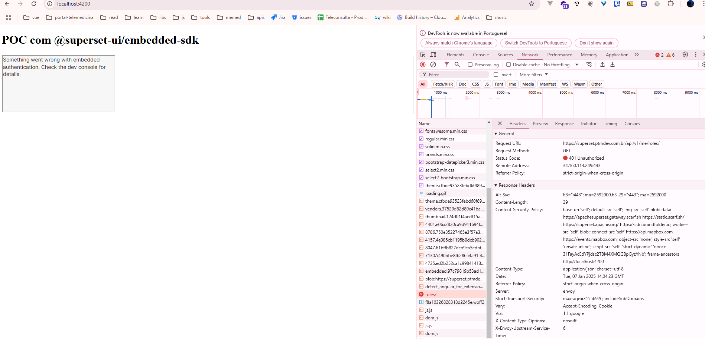

# Como rodar o projeto

1. `npm install`
2. `npm start`

Isso irá rodar em _localhost:4200_

**outra porta irá dar erro de cors**.

# Problema

O Iframe chama automáticamente o endpoint https://superset.ptmdev.com.br/api/v1/me/roles/ para
verificar se o usuário tem permissão de acesso.

Esse endpoint está retornando algo assim:

```json
{
"result": {
"createdOn": "2024-11-25T13:54:20.507506",
"email": "h.botelho@portaltelemedicina.com.br",
"firstName": "Henrique",
"isActive": true,
"isAnonymous": false,
"lastName": "Martins Botelho",
"permissions": {

    },
```

Veja que o permissions está vazio. Com ele vazio vai dar erro.


